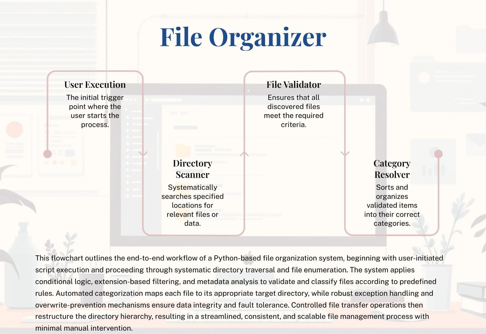

🚀 File Organizer

"File Organizer" is a Python-based file system automation utility engineered to intelligently classify, structure, and reorganize unstructured directories using extension-based categorization.
The system leverages Python’s OS-level abstractions to perform deterministic file analysis, dynamic directory provisioning, and safe relocation of assets — improving digital workspace maintainability and operational efficiency.
This project demonstrates practical automation engineering, clean architecture principles, and structured repository management using Git.

 🧠 Problem Context
Unstructured directories (e.g., *Downloads*, *Desktop*) frequently accumulate heterogeneous file types, leading to:
• Increased retrieval latency
• Reduced productivity
• Poor directory hygiene
• Manual file maintenance overhead

This tool programmatically enforces a deterministic folder hierarchy to eliminate clutter and optimize file discoverability.


 🛠 Technology Stack

| Component        | Purpose                               |
| ---------------- | ------------------------------------- |
| 🐍 Python 3.x    | Core programming language             |
| 📁 os module     | Directory traversal & file inspection |
| 🔄 shutil module | Atomic file movement                  |
| 🌿 Git           | Version control                       |
| 🗂 GitHub        | Repository management                 |


⚙️ Core Capabilities

✔ Deterministic extension-based classification
✔ Dynamic folder provisioning
✔ Idempotent execution (safe repeated runs)
✔ Modular and extensible category mapping
✔ Clean Git commit structure
✔ Production-style documentation

📂 File Classification Matrix

| Category     | Extensions              |
| ------------ | ----------------------- |
| 🖼 Images    | .jpg, .jpeg, .png, .gif |
| 📄 Documents | .pdf, .docx, .txt       |
| 🎬 Videos    | .mp4, .mkv, .avi        |
| 🎵 Audio     | .mp3                    |

 📁 Repository Structure

file_organizer/

│

├── main.py              # Core execution script

├── README.md            # Project documentation

├── .gitignore           # Git exclusions

└── LICENSE              # (Optional) Open-source license

 ▶️ Installation & Execution
 1️⃣ Clone Repository

```bash
git clone https://github.com/your-username/file_organizer.git
cd file_organizer
```
2️⃣ Execute Application
```bash
python main.py
```

📊 Execution Demonstration

🗂 Before Execution
```
Downloads/
    report.pdf
    song.mp3
    image.png
    video.mp4
```
 ✅ After Execution
```
Downloads/
    Documents/report.pdf
    Audio/song.mp3
    Images/image.png
    Videos/video.mp4
```

🧩 Engineering Decisions

🔹 Deterministic Mapping Strategy
    A dictionary-based extension mapping ensures **O(1)** lookup time for file categorization.
    
 🔹 Dynamic Directory Provisioning
    `os.makedirs()` safely creates folders without raising redundant exceptions.

 🔹 Atomic File Movement
    `shutil.move()` provides reliable file relocation with underlying OS-level handling.

🔹 Scalability Considerations
  The architecture allows easy:
• Addition of new categories
• Integration of CLI arguments
• Logging integration
• GUI extension


📈 Performance Characteristics

• **Time Complexity:** O(n), where *n* = number of files
• **Space Complexity:** O(1) auxiliary space
• Efficient for small to medium-sized directories

🧠 Key Technical Competencies Demonstrated
• File system automation
• OS abstraction handling
• Structured procedural design
• Clean repository management
• Git branching and commit hygiene
• Real-world problem modeling


